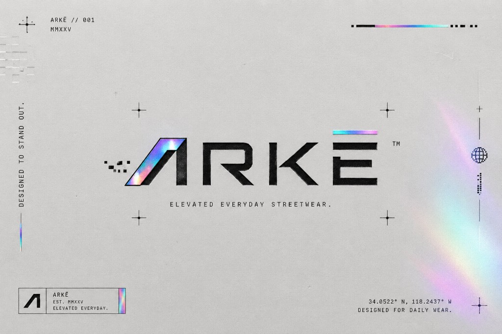

# James Matthew P. Bringquez — Portfolio

**Front-end Developer with an eye for design**

I build responsive web interfaces — and I care how they look and feel. This repo is my personal portfolio and a set of interactive project demos.

**[Live portfolio](https://bringquez-portfolio.vercel.app/)** · **[Resume (PDF)](https://bringquez-portfolio.vercel.app/resume/James-Matthew-Bringquez-Resume.pdf)** · **[LinkedIn](https://www.linkedin.com/in/james-matthew-bringquez/)** · **[Email](mailto:jamesbringquez@gmail.com)**

> Based in the Philippines · Professional web development experience since 2025

---

## Preview

| ARKĒ | Sera | Rally Point |
|:---:|:---:|:---:|
|  |  |  |

Open the [live site](https://bringquez-portfolio.vercel.app/) for the full experience (motion, contact form, and interactive demos).

---

## What this repo is

A single-page portfolio plus standalone project demos that open in their own layouts. Content lives in `src/data/portfolio.ts` so copy, skills, and projects stay easy to update.

---

## Featured projects

Each card on the site opens a **demo in a new tab** — separate from the portfolio chrome.

### [ARKĒ — Clothing Store](https://bringquez-portfolio.vercel.app/projects/arke-clothing)
Planned streetwear brand storefront. I designed the pearl / black / holographic identity and built the full demo: collections, product detail with size selection, favorites, shopping bag with persistence, and a demo checkout flow.

**Built with:** React · TypeScript · Tailwind CSS · Motion

### [Sera — Discord Bot](https://bringquez-portfolio.vercel.app/projects/sera-discord-bot)
Showcase for a Python Discord bot I use in real communities — music/voice, Japanese learning commands, and staff tools. The site presents the product story, command surface, and stack clearly.

**Built with:** React · TypeScript · Tailwind CSS · (bot: Python · discord.py)

### [Rally Point — Pickleball Club](https://bringquez-portfolio.vercel.app/projects/rally-point-pickleball)
Draft community site for a local pickleball club in Filinvest, Alabang — courts, events, and a membership join flow. Built as a full multi-page demo with mobile navigation.

**Built with:** React · TypeScript · Tailwind CSS

---

## Skills

### Primary stack (used at work)
C# · HTML · CSS · JavaScript · Bootstrap · SQL Server (SSMS) · MySQL · jQuery

### Building fluency
React · TypeScript · Tailwind CSS · Figma · UI/UX · Git · WordPress · Wix

### How I work with AI
I use AI tools to research and draft — then I review, understand, and test before anything ships.

---

## Built with (this portfolio)

- [React](https://react.dev/) + [TypeScript](https://www.typescriptlang.org/)
- [Vite](https://vite.dev/)
- [Tailwind CSS](https://tailwindcss.com/) v4
- [Motion](https://motion.dev/) — section and page animation
- [Phosphor Icons](https://phosphoricons.com/)
- [React Router](https://reactrouter.com/) — homepage + standalone demos

**Palette:** 60% white · 30% black · 10% blue

---

## Notable implementation details

- **Content-driven:** personal info, primary/learning skills, experience, and projects in `src/data/portfolio.ts`
- **Project demos:** nested routes under `/projects/...` with their own layouts (no portfolio navbar)
- **ARKĒ UX:** size-aware cart (`localStorage`), favorites, product pages, and demo checkout
- **Contact:** FormSubmit AJAX → `jamesbringquez@gmail.com`, plus resume download
- **Scroll UX:** section-aware scroll offset for navbar anchors

---

## Local setup

**Requires:** [Node.js](https://nodejs.org/) v18+

```bash
npm install
npm run dev
```

Open [http://localhost:5173](http://localhost:5173).

```bash
npm run build         # Production build
npm run preview       # Preview production build
npm run lint          # ESLint
npm run test:mobile   # Overflow checks on ARKĒ & Sera (dev server required)
```

### Where to edit

| What | Where |
|------|--------|
| Copy, skills, experience, projects | `src/data/portfolio.ts` |
| Routes | `src/App.tsx` |
| Homepage sections | `src/components/` |
| Project demos | `src/pages/projects/` |
| Resume PDF | `public/resume/James-Matthew-Bringquez-Resume.pdf` |
| Images | `public/images/` |

---

## License

Personal portfolio. Source is viewable for learning; please do not reuse branding, personal content, or project assets without permission.

© James Matthew P. Bringquez
